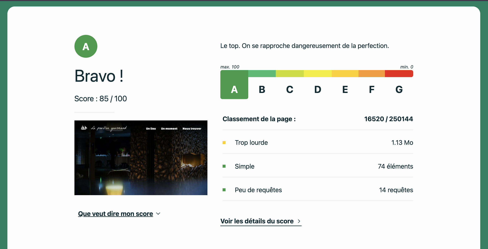
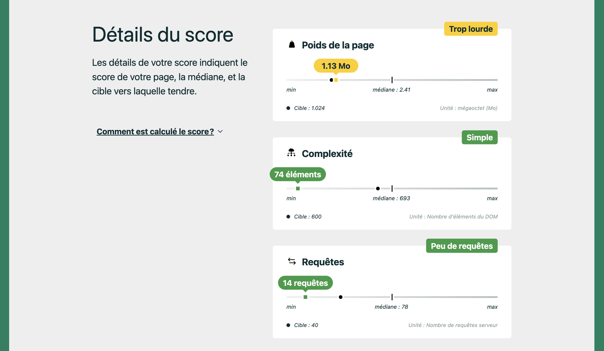
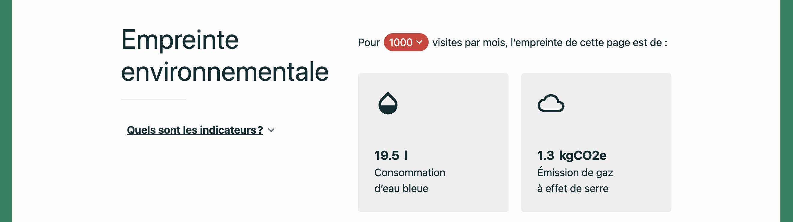
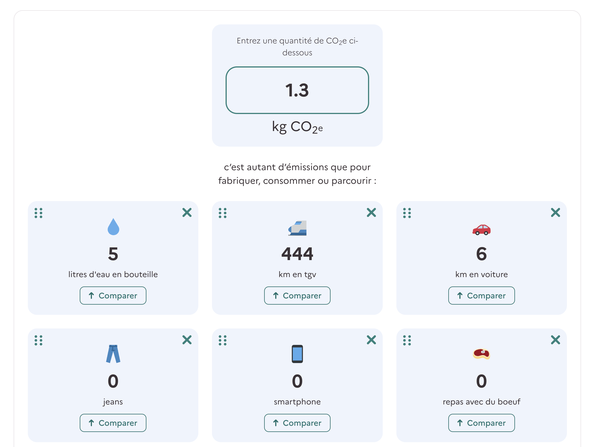
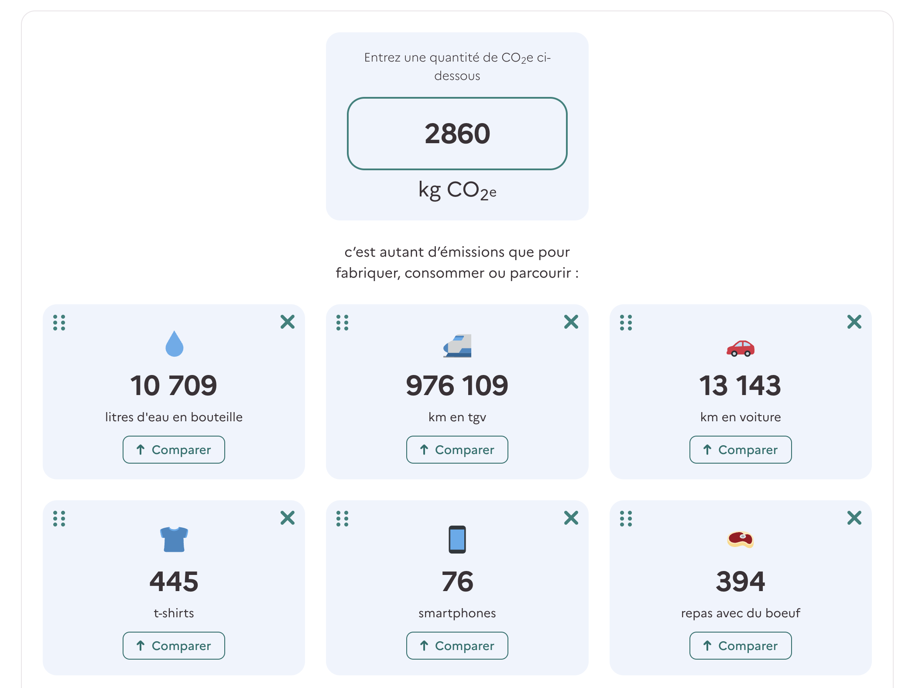
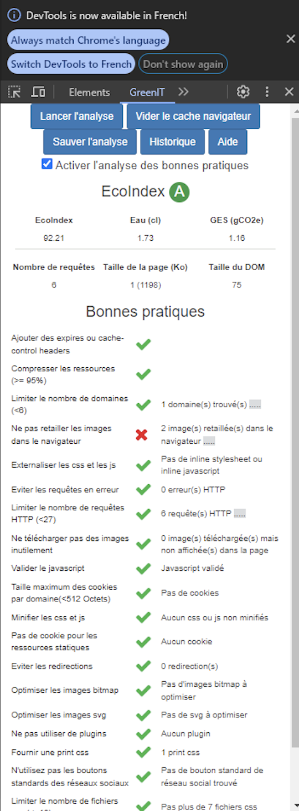

<h1 align="center"> ♻️ Eco Conception 💻 </h1>  

    

  Un site vitrine éco concu pour un étoilé vert michelin éco responsable.

## 👨🏽‍💻 Introduction à l'éco responsabilité dans le web

L'éco-responsabilité dans le domaine du web est devenue un enjeu crucial à l'heure où la consommation numérique ne cesse d'augmenter. 🌍

Le développement et l'hébergement de sites web peuvent avoir un impact significatif sur l'environnement, notamment en termes de consommation d'énergie, d'émission de gaz à effet de serre et de production de déchets électroniques. 💻

Pour réduire cet impact et contribuer à la préservation de notre planète, il est essentiel d'adopter des pratiques éco-responsables dans tous les aspects du développement web. ♻️

Cela comprend l'optimisation des performances des sites pour réduire la consommation de bande passante et d'énergie, la réduction de la taille des fichiers pour minimiser les transferts de données, ainsi que l'utilisation de technologies et d'hébergements éco-responsables. 🌱

En adoptant une approche éco-responsable dans la conception, le développement et l'hébergement de sites web, nous pouvons contribuer à limiter notre empreinte environnementale tout en offrant des expériences numériques de qualité à nos utilisateurs. 🖥️

Dans ce readme, nous explorerons ma stratégie pour rendre ce sites web plus éco-responsables, en mettant l'accent sur l'optimisation des performances et la réduction de la consommation d'énergie. 🌐

## ✅ Mes bonnes pratiques

Il éxiste environ **[115 bonne pratique d'écoconception](https://github.com/cnumr/best-practices)** web à ce jour, le but de ce projet est d'en appliqué le plus possible sans pour autant supprimer toutes les fonctionnalitées utiles du client.

Les bonnes pratiques que j'ai implementer:
 - [lazy loading](https://github.com/cnumr/best-practices/blob/main/chapters/BP_037_fr.md)
 - [Http 2.0 > 1.0](https://github.com/cnumr/best-practices/blob/main/chapters/BP_4006_fr.md)
 - [Valider par W3C](https://github.com/cnumr/best-practices/blob/main/chapters/BP_031_fr.md)
 - [Découper les CSS](https://github.com/cnumr/best-practices/blob/main/chapters/BP_021_fr.md)
 - [Optimiser les images](https://github.com/cnumr/best-practices/blob/main/chapters/BP_080_fr.md)
 - [Fournir une CSS print](https://github.com/cnumr/best-practices/blob/main/chapters/BP_027_fr.md)
 - [Externalisation du css](https://github.com/cnumr/best-practices/blob/main/chapters/BP_032_fr.md)
 - [Éviter les redirections](https://github.com/cnumr/best-practices/blob/main/chapters/BP_095_fr.md)
 - [pas plus de 10 fichiers css](https://github.com/cnumr/best-practices/blob/main/chapters/BP_022_fr.md)
 - [Optimiser la taille des cookies](https://github.com/cnumr/best-practices/blob/main/chapters/BP_082_fr.md)
 - [Optimiser les images vectorielles](https://github.com/cnumr/best-practices/blob/main/chapters/BP_036_fr.md)
 - [Utiliser les notations CSS abrégées](https://github.com/cnumr/best-practices/blob/main/chapters/BP_026_fr.md)
 - [Écrire des sélecteurs CSS efficaces](https://github.com/cnumr/best-practices/blob/main/chapters/BP_024_fr.md)
 - [Grouper les déclarations CSS similaires](https://github.com/cnumr/best-practices/blob/main/chapters/BP_025_fr.md)
 - [Éliminer les fonctionnalités non essentielles](https://github.com/cnumr/best-practices/blob/main/chapters/BP_001_fr.md)
 - [Ne pas redimensionner les images coté serveur](https://github.com/cnumr/best-practices/blob/main/chapters/BP_095_fr.md)
 - [Supprimer tous les warnings et toutes les notices](https://github.com/cnumr/best-practices/blob/main/chapters/BP_070_fr.md)
 - [Eviter d'utiliser des images matricielles pour l'interface](https://github.com/cnumr/best-practices/blob/main/chapters/BP_035_fr.md)
 - [Éviter la lecture et le chargement automatique des vidéos et des sons](https://github.com/cnumr/best-practices/blob/main/chapters/BP_4003_fr.md)
 - [Seuelement les portions indispensables des bibliothèques JavaScript et frameworks CSS](https://github.com/cnumr/best-practices/blob/main/chapters/BP_040_fr.md)

## 🈵 Les technos
 

  
  

 
Les langages utilisées sont les plus simple possible pour limiter un maximum le poid du projet, des import et des requetes.
Les frameworks ont souvent besoin de ressources supplémentaires pour fonctionner, ce qui peut entraîner une surconsommation de CPU et de mémoire sur les serveurs d'hébergement. De plus ils ont tendance à être volumineux et à inclure de nombreuses fonctionnalités souvent inutilisées. Cela peut augmenter la taille des fichiers téléchargés par les visiteurs, ce qui entraîne une consommation plus importante de bande passante.

## 🖥️ Ma solution

---

---

---

## 📉📈 Les metriques
Il existe plusieurs outils pour mesurer l'impact écologique d'une plateform web mais [EcoIndex.fr](https://www.ecoindex.fr/) est la plus connue. 

EcoIndex permet de prendre conscience de l’impact environnemental d’internet et de proposer des solutions concrètes.
L’analyse est gratuite, automatique et vous aide à identifier rapidement les sites web et services en ligne à revoir en priorité. Cela ne vous dispense pas de l’analyse complémentaire d’un·e expert·e pour disposer d’un bilan opérationnel complet et fiable.

Vous entrez une URL dans l’EcoIndex, qui calcule alors la performance et l’empreinte environnementale de la page testée :
 - La performance environnementale est représentée par un score sur 100 et une note de A à G (plus la note est élevée, mieux c’est !).
 - L’empreinte environnementale est matérialisée par les émissions de gaz à effet de serre et la consommation d’eau générées par la page.

Voici le score de la plateforme développée:

  
  
  

---

On peut constater que notre plateforme s'en sort très bien avec un score A. EcoIndex nous calcul sa consomation, pour 1000 visites par moi notre site engendre 1.3kgCO2e.

Mais 1.3kgCO2e ca n'est pas vraiment comprehensible, alors nous allons utiliser le [comparateur carbonne](https://impactco2.fr/comparateur) mis en place par l'état qui lui est un peu plus éxpressif :

  

---

Voici pour comparer les chiffres du site d'apple pour environ 1 million de visite par mois:

  

---

  

